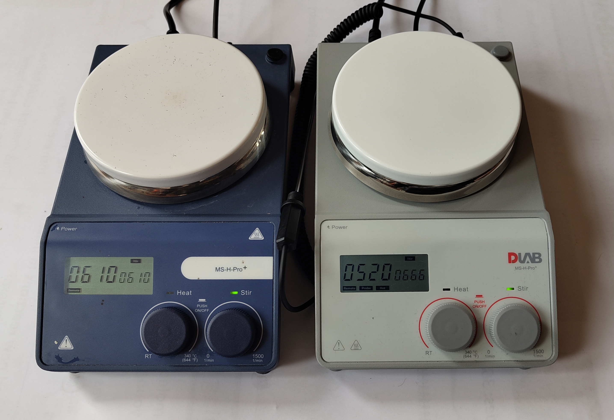

MSHPro
======
The MSHPro is low-cost hotplate stirrer.

The hotplate has a RS232 9-pin connector on the rear 
that allows control of its functions.
This package is a tool for control of these hotplates `via` serial interface.

A interface to all commands is provided by the :class:`Hotplates.MSHPro` class.
Commands are avilable to get information and control the hotplate's speed and temperature. 

All the formal communication structure is described by
the :mod:`Hotplates.MSHProCommunication` module.

Serial communication is full duplex and this is
acheived using :class:`Hotplates.SerialThreadedDuplex.Serial`, an
extension of PySerial's :mod:`serial.Serial`. 

Example usage:

::

   import Hotplates
   hp = Hotplates.MSHPro(port="/dev/ttyUSB0")
   hp.status()
   >> {'success': True, 'stir_set': 'Off', 'stir_actual': 0, 'heat_set': 'Off', 'heat_actual': 17.5, 'stir_on': False, 'heat_on': False, 'heat_limit': 340.0}
   hp.stir(400)
   # wait
   hp.status()
   >> {'success': True, 'stir_set': 400, 'stir_actual': 399, 'heat_set': 'Off', 'heat_actual': 17.7, 'stir_on': True, 'heat_on': False, 'heat_limit': 340.0}
   hp.off()
   # wait
   hp.status()
   >> {'success': True, 'stir_set': 'Off', 'stir_actual': 0, 'heat_set': 'Off', 'heat_actual': 1.1, 'stir_on': False, 'heat_on': False, 'heat_limit': 340.0}

.. automodule:: Hotplates.MSHPro
   :members:
   :member-order: bysource
  
MSHPro Communication
====================
.. automodule:: Hotplates.MSHProCommunication
   :members:
   :member-order: bysource

SerialThreadedDuplex
====================
.. automodule:: Hotplates.SerialThreadedDuplex
   :members:
   :member-order: bysource

Indices and tables
==================

* :ref:`genindex`
* :ref:`modindex`
* :ref:`search`

